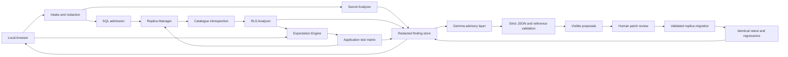

# Product requirements and architecture

## Problem → Attack → Security Control → Demonstrate & Test

**Problem.** Static scanners report permissive policies and credential-shaped strings without establishing authorization intent, actual access, impact or whether a change fixes the scenario. Developers waste time on public tables and cannot distinguish an interesting configuration from evidence of unauthorized access.

**Attack.** A low-privileged authenticated user selects, changes, deletes or inserts another user's data through overly broad RLS; an anonymous actor accesses data expected to be private. Separately, someone finding an exposed privileged credential may attempt privileged backend access. This product never attempts use of discovered credentials.

**Security control.** Establish an explicit Expected Access Model, build a disposable local replica, and run fixed deterministic scenarios using normal identities. Compare expected and observed behavior; explain with Gemma while maintaining a separate evidence record. Detect credential exposure statically with context and redact immediately.

**Demonstration.** User A retrieves User B's synthetic private profile despite expected denial. After review and replica-only remediation, the identical read is denied and User A can still read their own profile. A public posts table is correctly excluded from vulnerability claims. A frontend privileged-credential fixture is displayed redacted.

## Users, scope and success

Primary persona: a Supabase application developer who understands their intended permissions but needs reproducible evidence and a migration to review. Secondary persona: a security reviewer who needs to inspect provenance, assumptions and before/after results.

ASSUMPTION: v1 is a single-operator local desktop/laptop deployment. Public multi-tenant hosting is outside this design. Technology and limits are recorded in [decisions](decisions-and-open-questions.md).

In scope: source/config credential exposure, PostgreSQL base-table RLS and grants, declared/inferred intent, synthetic experiments, constrained remediation, regression checks and reproducible evaluation. Future work only: injection detection, XSS, dependency scanning, auth implementation audits, storage-policy verification, edge-function testing, arbitrary RPC/view testing and live infrastructure scanning. No chatbot, no production endpoint, no package installation during scanning, no application-source execution, no credential validity probes.

User stories: as a developer I upload ordered schema-only SQL and optional source; inspect redacted facts; correct the intent for each operation; inspect an attack hypothesis; run the matrix; approve a reviewable patch; compare before/after evidence; export a migration. As a reviewer I distinguish inferred intent, failed setup and actual denial, and see what was not tested.

## Functional requirements

| ID    | Requirement and acceptance test                                                                                                                                                                                                       |
| ----- | ------------------------------------------------------------------------------------------------------------------------------------------------------------------------------------------------------------------------------------- |
| FR-1  | Accept schema-only SQL, ordered migration files, optional source/config files and an expectation manifest. Display manifest/order and reject production connection fields, data dumps, archives and unsupported SQL with a reason.    |
| FR-2  | Detect only the two category enums; contextual credential fixtures cover every family in `security-and-safety.md` and public/placeholder negatives.                                                                                   |
| FR-3  | No raw secret appears in findings, logs, prompts, API responses, exports or errors; sentinel canaries are checked at every boundary.                                                                                                  |
| FR-4  | Build and destroy a local replica; expose no production URL input; catalogue hash and local mode accompany each result.                                                                                                               |
| FR-5  | Introspect RLS flags, all four commands, policy composition, roles, ownership, grants, columns, constraints and FKs after application. Missing metadata yields explicit coverage gaps.                                                |
| FR-6  | Persist one active expectation revision per resource/actor/operation with declared, inferred or unknown source; unknown prevents dependent probes.                                                                                    |
| FR-7  | Users can edit/confirm expectations and mark specific access intentionally public; suppress matching findings without removing history or suppressing writes.                                                                         |
| FR-8  | Gemma receives redacted structured input and returns strict JSON explanation, proposal, impact, hypothesis, severity/confidence, test recommendation and constrained remediation intent; invalid output never reaches an action path. |
| FR-9  | Generate the complete eligible per-table matrix using exactly the registry in `security-and-safety.md`; invalid or empty Gemma recommendations do not reduce coverage.                                                                |
| FR-10 | Seed two synthetic users and rows respecting supported types, constraints and FKs; deterministic unsupported cases produce `not_testable` with reason.                                                                                |
| FR-11 | Probes run under a checked non-owner, non-superuser, non-BYPASSRLS identity with transaction-local claims; role leakage test must pass.                                                                                               |
| FR-12 | Distinguish allow, RLS denial, grant denial, setup/error and no run; zero rows alone without controls never establish denial.                                                                                                         |
| FR-13 | Store immutable expected-vs-observed results with target/control evidence, schema/seed/test/claims/expectation identity and fidelity limits.                                                                                          |
| FR-14 | Enforce all eight finding states and transition preconditions; suppression and job progress are separate dimensions.                                                                                                                  |
| FR-15 | Render a migration from validated remediation intent; require human approval bound to patch and baseline digests; only a replica may receive it.                                                                                      |
| FR-16 | Rerun identical scenarios plus own-row/previously allowed regressions; `fixed` requires all gates. Export the patch and a redacted report.                                                                                            |
| FR-17 | Provide the finding story in the requested order, with persistent visual separation between AI analysis and verified evidence.                                                                                                        |
| FR-18 | Publish fixture-level counts, precision/recall, agreement and coverage with dataset/version/denominators; do not invent measurements.                                                                                                 |
| FR-19 | Reject or safely classify malicious SQL, injection text, oversized/invalid input, encoded secrets, invalid AI and failed replica application according to the adversarial catalogue.                                                  |
| FR-20 | Reproduce the flagship full loop and public-table/credential beats; fallback artifacts are visibly prerecorded with original provenance.                                                                                              |
| FR-21 | Supply a root `skills.md` during build with model, rationale, reproducibility and limitations as specified in `ai-layer-gemma.md` and implemented in root skills.md.                                                                  |
| FR-22 | Reject stale approvals/results after expectation or schema revisions; preserve historical evidence and run manifests.                                                                                                                 |
| FR-23 | Credential confirmation/removal uses static rules and complete rescans only; never imply validity, exploitation or revocation.                                                                                                        |
| FR-24 | Show AI-unavailable and partial/not-testable states without fabricating explanations or observations; deterministic work continues where independent.                                                                                 |

## Non-functional requirements

| ID     | Requirement / testable target (proposed until measured)                                                                                                                                                                        |
| ------ | ------------------------------------------------------------------------------------------------------------------------------------------------------------------------------------------------------------------------------ |
| NFR-1  | No scan/retest network connection outside app-owned loopback replica and local Ollama endpoints; egress-block fixture verifies this.                                                                                           |
| NFR-2  | Resource admission limits: 10 MiB total upload, 2 MiB/file, 200 files, 50 tables, 500 policies, 2,000 columns; exceed any → structured rejection before work.                                                                  |
| NFR-3  | One active replica job, replica 2 CPUs/1 GiB RAM/128 PIDs/512 MiB bounded data storage, 5-second statements, 1-second locks, 5-minute job deadline. Exceed → interruption with no passing verdict.                             |
| NFR-4  | Offline rehearsal: default demo deterministic loop completes within 60 seconds excluding human review and AI; Gemma has a 30-second request timeout and at most one retry. These are acceptance targets, not benchmark claims. |
| NFR-5  | Same admitted schema, fixture seed, engine version, claims and expectations give the same deterministic verdicts in three clean runs. AI text need not be byte-identical.                                                      |
| NFR-6  | All inputs/outputs are versioned and strictly validated; immutable observations and optimistic revision checks prevent stale mutation.                                                                                         |
| NFR-7  | Core review flow supports keyboard use, visible focus, text state labels and readable contrast; no color-only evidence distinction.                                                                                            |
| NFR-8  | SQL and source are untrusted; no raw source persistence. Admitted secret-free SQL and redacted metadata have explicit deletion controls and 24-hour local retention by default. Replica dies on completion or cancellation.    |
| NFR-9  | A worker crash marks in-flight jobs interrupted, cleans owned replicas, and preserves completed redacted evidence; rerun requires a fresh replica.                                                                             |
| NFR-10 | Reports always name mode, expectation source, tested scope and gaps. Banned unqualified claims (“secure”, “fully safe”, “guarantees”) never appear as success copy.                                                            |

## Release acceptance and risks

Must pass: full loop (FR-20), complete registry coverage on supported fixtures (FR-9), unknown/public handling (FR-6/7), zero sentinel leaks (FR-3), zero unsafe actions on adversarial fixtures (FR-19), and accurate denominators (FR-18). Detection metric targets are ≥0.90 precision and recall on the fixed credential corpus; deterministic verification agreement is 1.00 on supported labeled scenarios. These are release targets on a small fixture suite, not production accuracy estimates. Failure to meet them is reported and investigated rather than hidden by changing the denominator.

Principal risks: unsupported schema semantics, broken seed plans masquerading as denial, role/owner bypass, false public/owner inference, model hallucination, stage resource constraints and scope growth. Mitigations are explicit unknown/not-testable outcomes, positive controls, strict actor assertions, human expectation review, schema validation, offline rehearsal and the cut line in D-20.

Framework alignment is scoped: RLS scenarios address [A01:2025 Broken Access Control](https://top10.owasp.org/2025/A01_2025-Broken_Access_Control/) and [API1:2023 Broken Object Level Authorization](https://api-security.owasp.org/editions/2023/en/0xa1-broken-object-level-authorization/). This is a coverage mapping, not OWASP certification. Our AI boundary maps to the named LLM categories in [`security-and-safety.md`](security-and-safety.md).

## Architecture

Requirements: FR-1–FR-24; safety boundaries are elaborated in [Security and safety](security-and-safety.md). Choices are governed by [Decisions and open questions](decisions-and-open-questions.md); broader API/data-model targets below do not imply implemented endpoints.

## Runtime and responsibilities

ASSUMPTION: one local operator, one job at a time, a preinstalled container runtime and enough memory for a local Gemma model. Default: TypeScript pnpm workspace; Next.js App Router UI with thin Node.js Route Handlers; a separate long-lived Node.js worker; SQLite metadata/job queue; node-postgres (`pg`) for parameterized database operations; Docker CLI behind a narrow Replica Manager; plain PostgreSQL 17 replica; Gemma 4 E4B via local Ollama. CSS Modules keep styling dependencies small. Vitest and Playwright provide automated tests. Exact versions and artifact digests are pinned in [runtime-lock.json](../config/runtime-lock.json) and reported with evaluations.

Next.js supports Node.js Route Handlers and server-only environment variables; `NEXT_PUBLIC_` variables are included in client bundles. Keep all runtime credentials server-side. The independent worker avoids tying container and model jobs to HTTP request lifetimes. [Next.js Route Handlers](https://nextjs.org/docs/app/api-reference/file-conventions/route), [environment variables](https://nextjs.org/docs/app/guides/environment-variables).

| Component                 | Consumes → produces                                                    | Responsibility and boundary                                                                                                                              |
| ------------------------- | ---------------------------------------------------------------------- | -------------------------------------------------------------------------------------------------------------------------------------------------------- |
| Web App                   | Redacted API projections → review actions                              | Findings, expectations, runs and approval UI; never sees raw credentials or replica connection secrets.                                                  |
| Backend/API               | Validated forms/files → records/job IDs                                | Loopback session, CSRF/origin checks, bounded in-memory intake, admission/redaction, revision control, export. No Docker socket or direct model actions. |
| Secret Analyzer           | Transient source/config buffers → redacted static findings             | Detect, classify and redact before any persistence; no credential-use requests.                                                                          |
| RLS Analyzer/Introspector | Replica catalogues → schema snapshot and suspicious facts              | Evaluate supported policy signals and role/grant facts; cannot decide developer intent.                                                                  |
| Expectation Engine        | Manifest, heuristics, human edits → versioned expectations             | Resolves precedence, proposals, public suppression and matrix eligibility.                                                                               |
| AI Reasoning/Gemma        | Redacted bounded context → validated advisory JSON                     | Explanation, proposal and test/patch-template recommendation; no tools, shell or DB credentials.                                                         |
| Verification Engine       | Catalogue + expectation snapshot + seed plan → TestResult[]            | Owns registry, role assertions, queries, outcome classification and immutable evidence.                                                                  |
| Replica Manager           | Admitted SQL reference + trusted bootstrap → disposable replica handle | Creates, limits, initializes and destroys app-owned containers; never accepts a user database URL.                                                       |
| Remediation               | Validated intent + catalogue → migration patch                         | Fixed template renderer, scope checks, diff preview and digest-bound approval.                                                                           |
| Retest                    | Approved patch + baseline Run → new Run + RetestResult                 | Fresh patched replica; identical scenario keys and regression checks; no mutation of baseline evidence.                                                  |
| Evaluation                | Versioned fixtures/labels → report                                     | Runs deterministic and AI evaluations separately; records count/coverage/failure details.                                                                |

## Data flow and trust boundaries



Untrusted boundaries: browser uploads → admission; SQL AST → restricted schema loader; catalogue strings → redactor/model; Gemma JSON → validators; approved intent → SQL renderer. An approval never grants permission to bypass these validators. The worker alone has container control; the replica never receives the Docker socket, project directory, host secrets or model endpoint.

Data steps: (1) create project; (2) stream bounded inputs through redaction/admission; (3) persist only secret-free admitted schema and redacted context; (4) run credential analysis independently; (5) start replica and introspect; (6) establish visible expectations; (7) issue optional Gemma investigation; (8) run all eligible matrix cases, independent of AI readiness; (9) render/approve patch; (10) recreate baseline, apply patch, retest; (11) export and tear down. Unknown expectations pause only their dependent operations. Automatic matrix generation never invents missing intent.

## Persistence and API contract

This section retains the design contract. Implemented dispatch is in [api.ts](../apps/web/lib/api.ts) and [service.ts](../apps/web/lib/service.ts); the runtime schemas remain authoritative. Full SQL replacement is unsupported; source-only replacement/rescans use the existing intake bound. Delete requires an idle project: cancel active work, wait for cleanup acknowledgement, then delete. Optional full-fidelity mode and lease refinement remain unimplemented.

SQLite uses WAL with one writer worker and short transactions. Tables: `projects`, `input_manifests`, `schema_snapshots`, `findings`, `expectation_revisions`, `ai_analyses`, `runs`, `test_results`, `patches`, `approvals`, `jobs`, `audit_events`. JSON fields use the contracts in `finding-model-and-lifecycle.md`. Unique keys include `(project_id, input_revision)`, `(resource, actor, operation, revision)`, `(run_id, scenario_key)` and `(patch_id, digest, approved_by)`. Findings are redacted materialized views of immutable history. No database inside the replica holds the tool's evidence store.

Project record: `id`, `name`, `input_revision`, `expectation_set_revision`, `admitted_schema_digest`, `created_at`, `expires_at`. Job record: `id`, `project_id`, `kind` (`scan|verify|retest|rescan_credentials|evaluate`), `phase` (`intake|analyze|investigate|replica|seed|verify|apply|retest|report|cleanup`), `status`, `input_revision`, `idempotency_key`, `lease_until`, `progress` (completed/total), `error_code`, timestamps. Lease refinement (30-second leases and 5-second heartbeats) is a deferred design target; a startup reconciler fails interrupted work and removes only matching app-owned containers. No automatic replay of a partly applied patch.

All API bodies are strict JSON except bounded multipart intake. Errors: `{ "error": { "code": "STALE_REVISION", "message": "Review the current expectation before retrying.", "retryable": false }, "request_id": "req_demo" }`. Free-text database errors never enter the response. Mutation requests require a session, CSRF token, same-origin check, expected revision, and idempotency key where jobs are created. HTTP 400 invalid input; 409 stale state; 413 size; 422 unsupported schema; 503 unavailable worker/model. Model unavailability on investigation does not return a fake analysis.

| Endpoint                                    | Request / result                                                                                                                                                        |
| ------------------------------------------- | ----------------------------------------------------------------------------------------------------------------------------------------------------------------------- |
| `POST /api/projects`                        | `{name}` → project record                                                                                                                                               |
| `POST /api/projects/:id/inputs`             | Files, ordered SQL paths, optional expectation manifest; replace input revision atomically after complete admission → redacted manifest and scan job                    |
| `GET /api/projects/:id`                     | Project, coverage, active jobs and readiness                                                                                                                            |
| `GET /api/projects/:id/findings`            | Category/state/suppression filters → paginated finding summaries                                                                                                        |
| `GET /api/findings/:id`                     | Full redacted Finding, linked runs and revision                                                                                                                         |
| `PUT /api/projects/:id/expectations`        | `{expected_revision, changes: ExpectationEdit[]}` → new immutable revisions; validated against snapshot                                                                 |
| `POST /api/findings/:id/investigate`        | `{expected_revision}` → investigation job ID (job kind `scan`, phase `investigate`)                                                                                     |
| `POST /api/projects/:id/verify`             | `{input_revision, expectation_revision_ids}` → matrix job and eligibility/skip counts; no SQL/test body accepted                                                        |
| `POST /api/findings/:id/patches`            | `{analysis_id, intent_index, expected_revision}` → rendered patch/digest or unsupported reason                                                                          |
| `POST /api/patches/:id/approve`             | `{patch_digest, baseline_digest, expectation_revision_ids}` → recorded approval and retest job; exact action copy in `finding-model-and-lifecycle.md`’s UI requirements |
| `GET /api/runs/:id`                         | Immutable manifest and TestResult[]                                                                                                                                     |
| `GET /api/jobs/:id`                         | Status/progress, polled every second while active                                                                                                                       |
| `POST /api/jobs/:id/cancel`                 | Cancel, rollback/destroy replica; completed observations remain historical                                                                                              |
| `GET /api/findings/:id/export`              | Redacted report; validated SQL migration when available; nothing automatically applied elsewhere                                                                        |
| `POST /api/projects/:id/rescan-credentials` | New complete source manifest through the same intake path → comparison job                                                                                              |
| `DELETE /api/projects/:id`                  | Cancel owned work, remove artifacts and metadata; no cross-project deletion                                                                                             |

The `investigate` phase uses the same queue but never a replica privilege. Verification requires no `analysis_id`. For expectation edits, `expected_revision` means project.expectation_set_revision; for finding actions it means finding.revision. Arrays named expectation_revision_ids contain immutable Expectation.revision_id values (see `finding-model-and-lifecycle.md`). Endpoint paths are app-owned, never generated by Gemma. Event payloads, paths and error messages all pass redaction.

## Failure behavior

| Failure                                 | Required outcome                                                                                                                                                               |
| --------------------------------------- | ------------------------------------------------------------------------------------------------------------------------------------------------------------------------------ |
| Model timeout/invalid output            | `ai_analysis.status=unavailable` or `invalid`; deterministic work continues (FR-24).                                                                                           |
| Docker unavailable/start timeout        | Job failed; dependent current finding `blocked`; no observation.                                                                                                               |
| Unsupported SQL/extension/custom helper | Reject admission with object/statement location; project scan reports unsupported. Existing attributable findings become `not_testable`; never apply a silently edited schema. |
| Schema application error                | Roll back and destroy; job failed with sanitized SQLSTATE; no partial-schema verdict.                                                                                          |
| Seed failure/control failure            | Affected scenarios `not_testable`; independent supported tables may still run.                                                                                                 |
| SQL timeout/connection loss             | `error`, never `deny`; retry only as a fresh run.                                                                                                                              |
| Revision changes during a job           | Store result for its original revision and label stale; never overwrite current state.                                                                                         |
| Patch fails or regression breaks        | `fix_not_verified`; preserve baseline and error evidence, destroy patched replica.                                                                                             |
| Browser refresh                         | Resume view from durable job ID; no duplicate jobs on idempotent retries.                                                                                                      |

Optional full-fidelity mode uses local Supabase CLI containers and local JWTs through PostgREST, behind the same TestResult contract. It is beyond the must-have cut line; HTTP-specific differences and grants must be recorded rather than silently mixed with SQL-role results. [PostgREST transaction settings](https://docs.postgrest.org/en/stable/references/transactions.html) explain the request-claims context being simulated.

## Repository import and installed CLI

Repository import extension (D-23–D-26): POST /api/imports accepts a strict GitHub ImportRequest and returns ImportStatus; GET /api/imports/:job resumes it. POST /api/imports/:job/choose accepts ImportSelection, and /retry accepts an empty object. All use the existing session/CSRF/Origin/Host guards. Local directories are CLI-only; the browser cannot request arbitrary filesystem reads. Choices/retries reuse the server-owned request and pinned commit, create a new input revision, and invalidate the previous projection. Imports cannot replace projects with verified runs.

The `0.2.0` candidate adds automatic import to the existing local workbench. Historical release tags belong to the archived Git history and original repository, rather than the new single-commit Sicura repository. Read D-23–D-26 in `decisions-and-open-questions.md` for the binding decisions.

Build the artifact with Node 24.13.0/pnpm 10.29.1:

```sh
pnpm run package
npm install --global /absolute/path/to/sicura-0.2.0.tgz
sicura doctor
sicura scan .
sicura scan https://github.com/owner/repository --ref main
sicura ui
```

Consumers need Node, Git for local scans, Docker and the pinned PostgreSQL image, plus local Ollama/Gemma for AI analysis. Installation includes the compiled worker/CLI and production dashboard; no Sicura checkout, pnpm, TypeScript or project dependency installation is required. Native dependencies install on the consumer platform; model weights remain external. `sicura doctor --github` additionally checks the existing GitHub CLI login. Sicura has no token form and never requests production database credentials. Preparation pulls remain explicit operator steps; `doctor` reports missing prerequisites without installing them.

```sh
docker pull postgres@sha256:3645570cccdfa447589da9f57dd740faa29b30938e861289a5574b6ca6b03826
ollama pull gemma4:e4b
```

The model digest must match `config/runtime-lock.json`; an updated tag fails provenance validation. The root README describes model preparation. `--no-open` prints the dashboard URL for headless use; `--port 3229` selects another loopback port. Keep the CLI in its terminal and stop it with Ctrl-C. A later scan can reuse the running application. Runtime assets resolve from the installed package. For compatibility with existing projects, data continues to default to Linux `$XDG_DATA_HOME/proofsec` (or `~/.local/share/proofsec`), macOS `~/Library/Application Support/ProofSec`, or Windows `%LOCALAPPDATA%/ProofSec`. `PROOFSEC_DATA_DIR` can override it, but local scans reject data directories inside the scanned workspace.

Local discovery reads tracked and non-ignored files with their saved working changes. Persist workspace provenance as a project-keyed digest; raw source stays in worker memory. Ignored untracked paths are outside coverage. GitHub resolves the default branch/ref once and reads that commit through fixed HTTPS hosts; public contents come from the pinned raw path and must match the tree blob hash. Private contents use read-only `gh api` and existing login. No cloning, archive download/extraction, hook/repository execution or dependency installation occurs. Ingress never changes replica networking.

Budgets are 500 eligible files, 10 MiB total and 2 MiB/file, credential batches at most 200, four simultaneous reads, 20,000 tree entries, 15-second request/subprocess bounds and a 120-second import deadline. Dependencies, generated output, binaries, archives, weights, links, submodules, invalid encodings and oversized files have visible exclusions. File/count aggregate overflow stops the import. The existing 200-file upload and 2 MiB combined executable SQL/parser bounds remain unchanged. A large SQL chain gets an explicit coverage reason and no replay, even when its credential scan fits the source budget.

Supabase migrations take priority. Conventional migration roots support numeric/timestamp ordering, including nested Prisma migrations and Flyway numbered SQL; schema/structure files are fallback only when migrations are absent. Multiple roots or ambiguous order require a dashboard choice. Excluded/oversized migrations prevent complete replay. ORM schemas are metadata. Unsupported functions, triggers, extensions, procedural blocks, Storage policies or any other unsupported statement reject the complete chain; no statements are dropped to manufacture coverage. SQL credential findings survive that rejection.

The Project screen shows commit/workspace provenance, credential coverage, RLS readiness/reasons, exclusions and ordering. Supported SQL is admission coverage, not a passing test. Review Expected Access before verification: inferred SELECT remains qualified; other intent starts unknown. Unknown operations remain skipped and prevent a complete fix verdict. Gemma proposals remain inactive until a human saves them. Existing exact approval digests, low-privilege controls and identical retest/regression gates remain mandatory.

Imports share the durable serial job queue. Matching idempotency keys bind exact requests; equivalent active requests reuse their job. A fresh scan after completion imports current saved changes/default branch. Refresh resumes status; worker interruption requires an explicit retry. Root choices retry the original pinned commit/server-owned local request. Verified projects cannot be overwritten through import retry.

## Connected frontend and repository migration

D-28 adopts the dark emerald frontend design from original frontend commit `957ab966304a84d1c3e669da6cc29831a93e79f2` around the current workflow components. `/` is a landing page; `/app` hosts the four release workbench screens (D-30). CLI UI/scan links use `/app`, with `project` selecting the exact imported project. Legacy root project links redirect. D-30 removes demo actions and automatic project creation: legacy demo query parameters are removed without a mutation; project links still select their exact stored project. Job polling, CSRF, schema validation, import coverage/retry and optimistic revision behavior remain unchanged.

Fonts are bundled with `next/font/local`; config/fonts-lock.json pins their upstream commit and file digests, and licenses/fonts preserves the SIL Open Font License notices. The prepared browser/build needs no font-provider request. Public packaging includes the compiled font assets and licenses. No backend API or persisted contract migration is introduced.

After required checks pass, publish the tracked snapshot to https://github.com/sandipansingh/Sicura.git as one parentless main commit. Preserve the original complete Git metadata, including the Gemini stash, in a sibling history backup. Local data/.env stay in place and are excluded from publication. Only the new repository is origin; do not push old branches or tags. Historical reports retain their original commit/dataset provenance.

D-30 separates product operation from engineering fixtures: released /api/demo (GET/POST) and /api/evaluation (GET) are removed and return the existing authenticated NOT_FOUND response. Project creation and bounded file intake remain /api/projects and /api/projects/:id/inputs; no schema or persisted-record migration is needed. Artificial candidate injection is no longer reachable through the application service. The npm runtime excludes evaluation fixtures/reports, while the repository keeps original engineering datasets and results. The README uses the ordinary import → expectations → verify → review → replica retest → export workflow.

## Project analysis and repository rescans (0.3.0, D-31)

A bounded parser inspects ordered SQL separately from execution admission. It reduces table/column/ownership declarations, RLS flags, policy creation/alteration/drop/rename and direct table grants/revokes. Functions, triggers, extensions, sequences and views are inventoried as execution blockers without retaining or executing their bodies. Procedural/default-privilege changes and unsupported alterations make final state uncertain. Only the unchanged complete-chain `repository-v2` allowlist produces executable SQL. Uploads also retain credential and SQL analysis when replay is rejected.

`SQLAnalysis` stores redacted metadata, completeness, replica-readiness and file/line/statement diagnostics. It is separate from observed `SchemaSnapshot`. Existing budgets remain: 2 MiB SQL, 2,000 statements, 50 tables, 2,000 columns and 500 policies; static diagnostics are capped at 2,000 and direct grant declarations at 2,000. Partial inventory is labeled incomplete; exceeding analysis bounds does not enable replay.

ProjectView adds optional `sql_analysis` and `summary`, returned as null for absent legacy records. POST `/api/projects/:id/investigate` accepts input_revision and expectation_set_revision and returns JobEnvelope. A distinct project_analysis job handles advice after deterministic work commits. POST `/api/projects/:id/rescan-repository` accepts the same revision guards and returns JobEnvelope. It reuses only the server-owned original import request/selection; it accepts no browser local path. Both preserve session/Host/Origin/CSRF/idempotency guards and the serial queue.

Repository rescans read current saved local files or a freshly resolved GitHub ref. They advance input revision, preserve compatible intended-access declarations, supersede approvals and keep earlier evidence historical. Batches retain importer budgets (up to 500 files); manual uploads still accept at most 200 files. Removal requires accounting for prior manifest paths and retained credential occurrences, including earlier gaps. Missing local paths require checked ENOENT without following ancestor symlinks; ignored/unreadable/excluded paths do not establish deletion. An absent GitHub path must be absent from the complete pinned tree, not an exclusion.

Install the updated artifact with `npm install --global /absolute/path/to/sicura-0.3.0.tgz`, then `sicura scan /path/to/project --port 3229`. Stop the prior CLI before replacing/restarting it. Existing data directories and PROOFSEC settings retain compatibility.

Replica startup/apply failures preserve static review and enqueue advisory analysis independently. Current catalogue projections bind the admitted SQL digest; source-only rescans may reuse an identical catalogue, while a changed or unsupported chain cannot inherit one. Legacy catalogues without a digest are exposed only at their original input revision.

For CLI/repository imports, file collection is automatic and the saved-project UI omits manual upload. Repository rescans reuse the CLI-owned source; the browser does not request a new filesystem path.

## Expanded repository database replay (D-32)

Repository imports first attempt the compatible repository-v2 path, then bounded repository-v3 admission. The expanded path rereads an ordered manifest of path/byte/digest identities through the original authorized source; GitHub is pinned to the imported commit. Routines and raw AST remain transient, including between import and verification. Changed files produce REPLAY_INPUT_CHANGED and require Rescan repository. The complete catalogue becomes available only after the full chain succeeds; failure destroys the staged replica. Manually admitted projects retain their existing profile.

Database compatibility includes listed extensions, auth.users/claims helpers, storage objects/foldername and known roles. It has no Supabase services or production credentials. Separate restricted loader and checked verifier connections prevent transaction escape. Synthetic prerequisite seeds preserve constraints/triggers and are scoped per target dependency closure.

0.4.0 handoff: `pnpm install --frozen-lockfile`, `pnpm run check:env`, `pnpm run verify`, `pnpm run package`, `pnpm run test:package`. Consumer verification uses an actual transaction-wrapped PLpgSQL trigger repository through the compiled CLI and production dashboard. Install `.local/artifacts/sicura-0.4.0.tgz`, stop the older CLI, and run `sicura scan . --no-open --port 3229` from the target repository. Port 3229 serves the loopback dashboard; no target database connection is made.
The checked 0.4.0 tarball was globally installed and the CLI restarted from Muvira on loopback port 3229. Both a fresh scan and the older saved project's repository rescan obtained the expanded catalogue; the older project advanced to input revision 2. Existing data, environment settings and target-project files were preserved.
